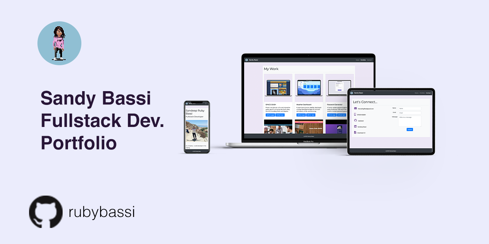

# Sandy Bassi Fullstack Developer Portfolio

## Background

This project is an updated version of my responsive portfolio using Bootstrap CSS Framework to create a mobile UI website. 

Demonstrating employer-competiveness, through updated and optimised projects and social media profiles, is greatly encouraged on the University of Birmingham's coding bootcamp course. 

With this in mind, we was tasked with updating our portfolios to showcase our first group project and a selection of exemplary homework assignments. In addition, a downloadble CV and recent contact details were to be included so that employers can reach out.

I copied my previous project and imported it to preserve the commit history. I used semantic HTML elements for accessibility and best practice for structure.

[View my final project on GitHub pages](https://rubybassi.github.io/Sandy-Bassi-Fullstack-Dev-Portfolio/index.html)

### Preview

The following image previews the website layout on all devices.

### My Development Enviromment:
* [Visual Studio Code](https://code.visualstudio.com/)
* Terminal
* [Git](https://git-scm.com/book/en/v2/Getting-Started-Installing-Git)
* [Bootstrap](https://getbootstrap.com/)
* [Google Fonts](https://fonts.google.com/)
* [Font Awesome](https://fontawesome.com/)
* [W3 HTML validator checker](https://validator.w3.org/)
