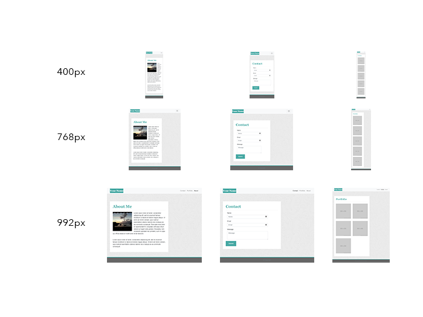
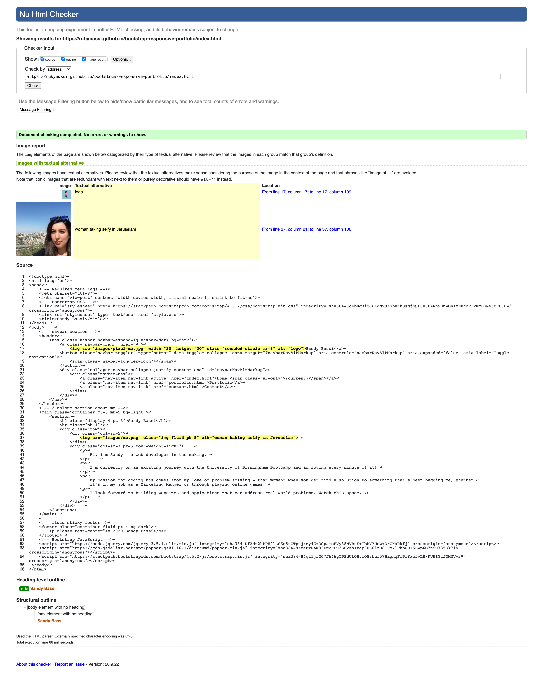

# CSS Bootstrap: Responsive Portfolio

## Background

This project is my attempt of using Bootstrap CSS Framework to create a mobile responsive portfolio. I used semantic HTML elements for accessibility and best practice for structure.

[View my final project on GitHub pages](https://rubybassi.github.io/bootstrap-responsive-portfolio/index.html)

Comments were added throughout both HTML and CSS files, highlighting key conponents. Images were correctly sized for site speed performance.

### Challenges

Alot of reading! There was a substantial amount of documentation to read through to understand the layout, conponents and utilities that Bootstrap has to offer. I used a mix of reading, Googling and Youtube videos to help understand the basics and some trickier conponents such as the sticky footer.

If you have feedback / advice on the above, please feel free to comment.

### Expected Layout Mockup

The following image was provided to demonstrate how the web application's layout should resemble, although there was room for customisation:

### My Development Enviromment:
* [Visual Studio Code](https://code.visualstudio.com/)
* Terminal
* [Git](https://git-scm.com/book/en/v2/Getting-Started-Installing-Git)
* [W3 HTML validator checker – results below](https://validator.w3.org/)

